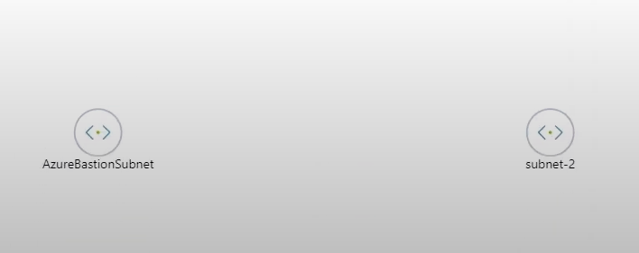
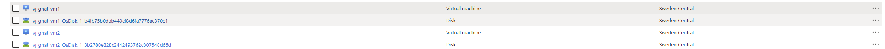
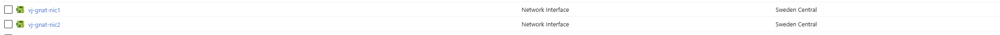
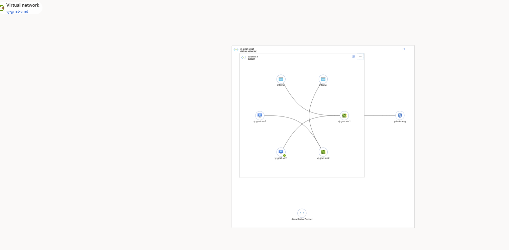
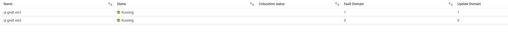
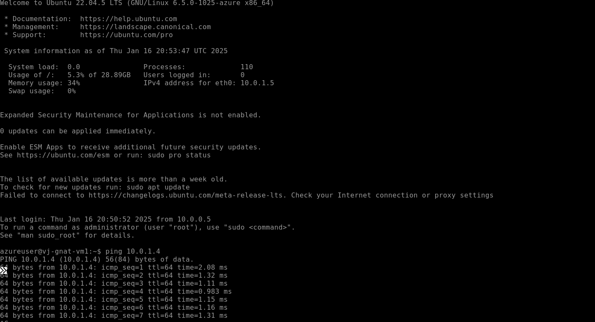

# azure-terraform
Creating Resource Group

Creating Virtual Network _ with 2 subnets 1. for Bastion and the other for VM's

Configuring Availablity Sets 

Configuring ubntu image & os disk

Configuring Network Interface cards with Dynamic IP

VM's

NIC's

Topology

av sets 

Let's Ping VM2 from VM1 to test
